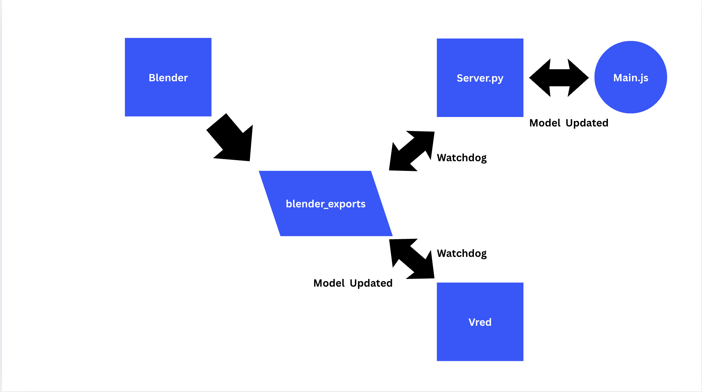

# Blend-to-Three.js & VRED Live Pipeline



**Real-time 3D model pipeline that eliminates manual export/import cycles between specialized 3D software, VRED, and web visualization.**

## Problem
3D artists and developers waste time with repetitive export → import → refresh workflows when collaborating across different software tools. A 30-second manual process repeated dozens of times daily.

## Solution
Automated live pipeline that instantly syncs 3D models from any software to web browser or VRED:
- Export from Blender → automatically appears in Three.js viewer **and/or** VRED
- Real-time updates via WebSocket (for web) or direct auto-load (for VRED)
- Zero manual steps, zero waiting

## Architecture
```
Blender Addon → GLB Export → File Watcher → 
    ├─ WebSocket → Three.js Viewer
    └─ VRED Loader → VRED Scene
```

**Tool-agnostic design**: Works with any software that can export GLB (Blender, VRED, Unreal, CAD tools) - just swap the export script.

## Features
- **One-click export** from Blender with timestamp naming
- **Live file monitoring** with automatic change detection
- **Instant browser updates** via WebSocket notifications
- **Automatic VRED scene updates** via VRED Python loader
- **Smart model framing** - auto-centers and scales models
- **Performance metrics** - file size, load times displayed
- **Clean minimal UI** - focus on the 3D content

## Quick Start
1. Install Blender addon: `blender_scripts/quick_export_addon.py`
2. Run server for web pipeline: `python server.py`
3. (Optional) Run VRED loader inside VRED: `vred_loader.py`
4. Open browser: `http://localhost:5000`
5. Export from Blender → see instant update in browser and/or VRED

## Tech Stack
- **Backend**: Python (Flask, SocketIO, Watchdog)
- **Frontend**: Three.js, WebSocket client
- **3D Pipeline**: Blender Python API, GLB format
- **VRED Integration**: VRED Python API, Watchdog

## Use Cases
- **Design Review**: Instant model sharing with stakeholders
- **Cross-team Collaboration**: Bridge between 3D artists, web developers, and visualization teams  
- **Rapid Prototyping**: Fast iteration cycles for 3D content
- **Live Presentations**: Real-time model updates during meetings

## Extensibility
The core pipeline works with any 3D software:
- **VRED**: Replace Blender addon with VRED Python script
- **Unreal Engine**: Use Blueprint/Python for GLB export
- **CAD Tools**: Any software with GLB export capability

Built to solve real workflow problems in automotive design and advanced manufacturing environments.